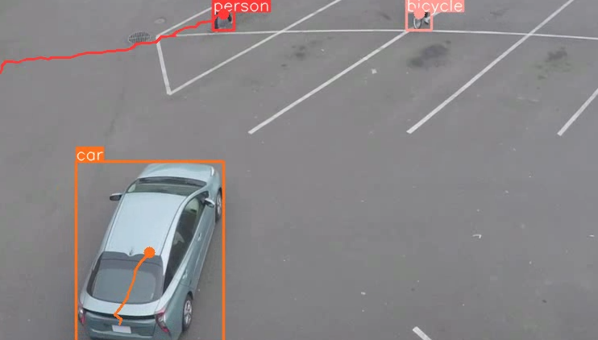

# Naive object tracker

## Instructions 
1. Install anaconda from https://www.anaconda.com/download/success
2. Create a conda environment `conda env create --file environment.yaml`
3. Active the environment `conda activate naiveobjecttracking`
4. Download a sample video `wget "https://github.com/intel-iot-devkit/sample-videos/raw/master/person-bicycle-car-detection.mp4"`
5. Run the program with a filepath as an argument`python main.py person-bicycle-car-detection.mp4`
6. The output will be saved as `object_tracker_output.avi` 

